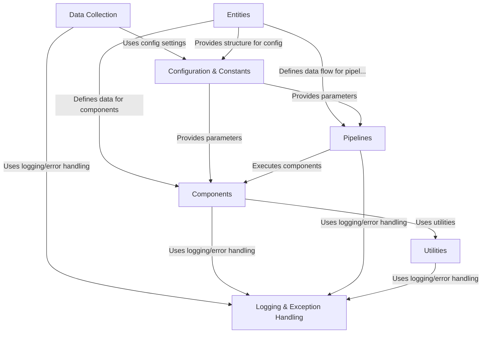

# Sign-detection-using-YOLO

This project is designed to build a system for **detecting sign language gestures**. It involves *collecting images* of different signs, using a structured *machine learning pipeline* to prepare the data and *train a detection model*, and providing ways to *handle errors* and *manage settings* consistently throughout the process.


## Visual Overview



## Chapters

1. [Logging & Exception Handling
](01_logging___exception_handling_.md)
2. [Entities
](02_entities_.md)
3. [Configuration & Constants
](03_configuration___constants_.md)
4. [Utilities
](04_utilities_.md)
5. [Data Collection
](05_data_collection_.md)
6. [Components
](06_components_.md)
7. [Pipelines
](07_pipelines_.md)

---

<sub><sup>Generated by [AI Codebase Knowledge Builder](https://github.com/The-Pocket/Tutorial-Codebase-Knowledge).</sup></sub>


## How to run:

```bash
python -m venv signlang
```

```bash
signlang\Scripts\activate
```

```bash
pip install -r requirements.txt
```

```bash
python app.py
```
